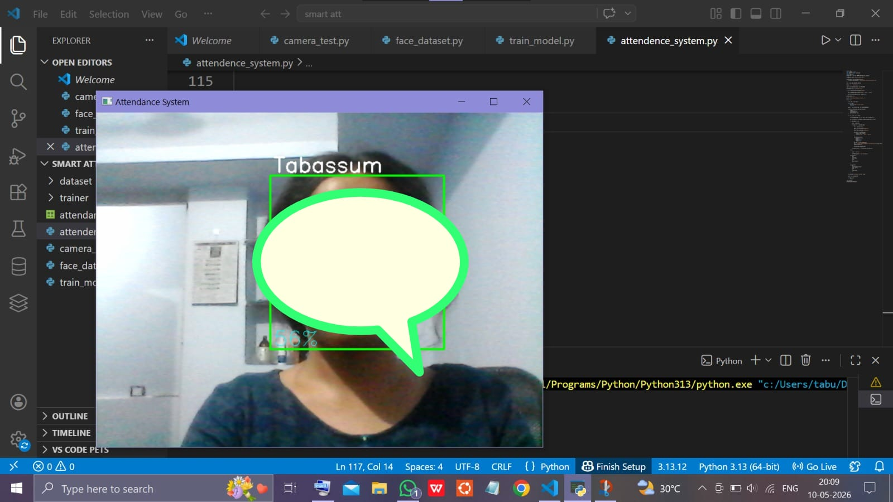

# Face Recognition Attendance System

A real-time face recognition and attendance monitoring system developed using Python, OpenCV, and ThingSpeak cloud integration.

## Features

- Real-time face detection using webcam
- Face recognition using trained dataset
- Automatic attendance marking
- Attendance stored in CSV file
- Cloud updates using ThingSpeak
- Simple and user-friendly interface

## Technologies Used

- Python
- OpenCV
- NumPy
- Pandas
- ThingSpeak Cloud
- VS Code

## Project Files

- `face_dataset.py` → Collects face dataset
- `train_model.py` → Trains face recognition model
- `attendance_system.py` → Main attendance system
- `attendance.csv` → Stores attendance records

## How the System Works

1. Face dataset is collected using webcam
2. Images are trained using OpenCV
3. Camera detects and recognizes faces in real-time
4. Attendance is automatically updated
5. Attendance data is sent to ThingSpeak cloud platform

## Project Output

### Face Detection

### Terminal Output

### ThingSpeak Cloud Update

## Future Improvements

- Add multiple user support
- Improve recognition accuracy
- Add database connectivity
- Deploy on Raspberry Pi

## Author

Tabassum H Doddamani
